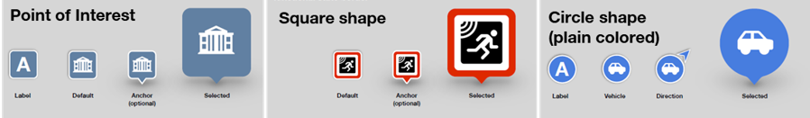
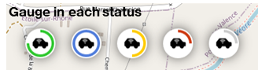
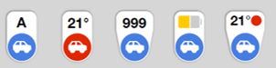
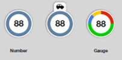
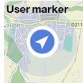
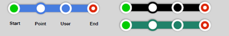

# IOT-Map-Component 

## Table of contents

- [Presentation](#presentation)
- [Quick start](#quick-start)


## Presentation

IOT-Map-Component is a map component, based on [Leaflet](https://leafletjs.com/), to be integrated in computer or mobile web applications developed in Angular or REACT. 
It provides Orange branded design and User eXperience. 

This component manipulates the following <ins>entities</ins>, with according **attributes** (and *values*) :

<ins>Markers</ins>, to be displayed at a **location**, on a **layer** of the map, potentially associated with a **popup** HTML message, bringing, as a string, information of a **status**. In order to modify their display, markers contain: 
- a **shape** which can be of different **type** (*poi* (Point of Interest), **circle*, *square*), be **anchored** or not, displayed in a **color**, with a **percent** gauge, and with a cicle of **accuracy**. **Circle** and *poi* shapes are **plain**, whereas *square* shapes are not **plain**.
- an **inner** which can be either an **icon** or a **labe**, in a specific **color**,

Note that only **anchored** shapes appear bigger when selected.





- [NOT IMPLEMENTED YET] An always visible **tab** can be optionnaly added to every marker, for additionnal information:



3 ways allow to customize markers :
- Playing with attributes.
- Defining marker types, with default types implementing Orange design.
- Defining marker status, that are used for clusterization, with default status implementing Orange design.

<ins>Clusters</ins> to replace several markers, depending on the map zoom level.
Markers are clusterized:
- by layer (2 markers from 2 different layers will not be clusterized).
- using **status** attribute for the color repartition on cluster, and information displayed in the cluster popup.

Automatic clustering (engined by Leaflet) can be used to manage up to 100 000 markers. Beyond that, *external* mode allows to manage manually clusters.



[NOT IMPLEMENTED YET] <ins>User location</ins> to display the current location of the application user, **with direction** (**angle** in degree) or not.



[NOT IMPLEMENTED YET] <ins>Paths</ins> to display a path between several **locations**, including a **start** and an **end**, and with a **color**.



## Quick start

Several quick start options are available:
- [Download the latest release](https://github.com/Orange-OpenSource/IOT-Map-Component/archive/v0.3.1.zip), and integrate it in your project,
- Install with [npm](https://www.npmjs.com/): `npm install iotmapmanager`

Then, display a map by inserting in your page:
```
 <map-component></map-component>
```
Angular sample of use is given in ```map/map.components.ts``` (and not included by npm) to display/refresh map elements, using javascript **IoTMapManager** class methods (see [src/iotMapManager/readme.md](https://github.com/Orange-OpenSource/IOT-Map-Component/blob/master/src/iotMapManager/readme.md)).


