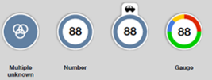

# IOT-Map-Component 

## Table of contents

- [Presentation](#presentation)
- [Quick start](#quick-start)


## Presentation

IOT-Map-Component is a map component, based on [Leaflet](https://leafletjs.com/), to be integrated in computer or mobile web applications developed in Angular or REACT. 
It provides Orange branded design and User eXperience. 

This component manipulates the following <ins>entities</ins>, with according **attributes** (and *values*) :

<ins>Markers</ins> of different **shape** : *poi* (point of interest), *square* and *circle* (the last 2 for any elements to be displayed). 
- Shapes can have a **color**, **anchored** or not, **selected** or not.
- Square shapes and circle shapes can be displayed **with direction** (**angle** in degree) or not, and **plain** colored or not.
- Markers can be displayed also with a **position**, a **label** (**character** and **label color**) or an **icon** (**svg** description and **icon color**). 


- An always visible **tab** can be optionnaly added to every marker, for additionnal information :


- On square and circle shapes, the border color can be used to represent a **gauge** : 


<ins>Clusters</ins> to replace several markers, depending on the map zoom level.
- These clusters can be displayed with the **number** of markers, with an **icon**, and with a **gauge** representing repartition of markers replaced by this cluster.



<ins>User location</ins> to display the current position of the application user, **with direction** (**angle** in degree) or not.


<ins>Paths</ins> to display a path between several **positions**, including a **start** and an **end**, and with a **color**.


[comment]: <Examples of use can be found in [samples](https://github.com/Orange-OpenSource/IOT-Map-Component/samples).>

[comment]: <TbAdded image of one sample>

## Quick start


- [Download the latest release](https://github.com/Orange-OpenSource/IOT-Map-Component/archive/v0.1.1.zip), and integrate it in your project,
- Display a map by inserting in your page:
```
 <map-component></map-component>
```
- Modify **MapComponent** class in ```map.components.ts``` to display/refresh map elements, using **IoTMapManager** class methods (see [src/iotMapManager/readme.md](https://github.com/Orange-OpenSource/IOT-Map-Component/blob/master/src/iotMapManager/readme.md)).


