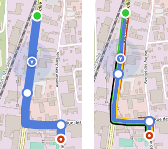

# IOT-Map-Component 

## Table of contents

- [Presentation](#presentation)
- [Quick start](#quick-start)
- [Storybook](#storybook)


## Presentation

IOT-Map-Component is a map component, based on [Leaflet](https://leafletjs.com/), to be integrated in computer or mobile web applications developed in Angular or REACT. 
It provides Orange branded design and User eXperience. 

This component manipulates the following <ins>entities</ins>, with according **attributes** (and *values*) :

<ins>Markers</ins>, to be displayed at a **location**, on a **layer** of the map, potentially described by a **popup**, with **title** and **body** HTML messages displayed on click. Markers contain also: 
- a **shape** with a **type** (can be *circle* or *square*), **anchored** or not, **plain** or not, displayed in a **color** and with a circle of **accuracy**. For *circle* shapes, **shape** can contain additionnally a **percent** gauge and a angle (0-360) **direction**,
- an **inner** which can be either an **icon** or a **label**, in a specific **color**,

Note that shapes appear bigger when selected, and always with an anchor for a better accuracy.


<ins>Templates</ins> can be used to define marker templates, setting one or several markers attributes. By setting **template** attribute, marker inherits template attributes.

3 templates are defined:
- *circle* for objects,  
- *square* for a second representation of objects,
- *poi* for points of interest.


<ins>Status</ins> can be used, in the same way, to define marker status, setting on or several markers attributes. By setting **status** attribute, marker inherits status attributes.

Status is also used by clusterization: repartition of clusterized markers is based on status **color**, and cluster popup displays **singular** or **plural** status **name**.

Note that order of priority concerning attribute value is : status, then template, then attributes.

Several status are defined: 
- For objects: *positive*, *neutral*, *warning*, *alert*, *inactive*, 
- For PoIs: *foodAndDrink*, *shopping*, *health*, *entertainment*, *services*, *civilServiceWorship*, *outdoor*, *transport*, 


- An always visible **tab**, in *large* or *normal* **type**, can be optionnaly added to every marker, for additionnal HTML **content** information:


<ins>Clusters</ins> to replace several markers, depending on the map zoom level.
Markers are clusterized:
- by layer (2 markers from 2 different layers will not be clusterized together). Layers can be optionnally qualified by an HTML **content**, for cluster to display it in a tab, in *large* or *normal* **type**, and in its popup.
- using **status** attribute for the color repartition on cluster, and information displayed in the cluster popup.

Automatic clustering (engined by Leaflet) can be used to manage up to 100 000 markers. Beyond that, *external* mode allows to manage manually clusters.


<ins>User marker</ins> to display the current location of the application user, with an optionnal **direction** (in degree) and **accuracy**.


<ins>Paths</ins> to display a path relying a list of **points**, with a **color**. Above the starting and end positions that are displayed automatically, intermediate **positions** can be specified. Paths can be optionally completed by **additional** ones, specifying **points**, **color**, and **line** number.



## Quick start

Several quick start options are available:
- Download the latest release, and integrate it in your project,
- Install with [npm](https://www.npmjs.com/): `npm install iotmapmanager`

Then, display a map by inserting in your page:
```
 <map-component></map-component>
```
Angular sample of use is given in ```map/map.components.ts``` (and not included by npm) to display/refresh map elements, using javascript **IoTMapManager** class methods (see [src/iotMapManager/readme.md](https://github.com/Orange-OpenSource/IOT-Map-Component/blob/master/src/iotMapManager/readme.md)).

## Storybook

In order to discover or demonstrate, without any integration, entities and attributes defined in the map component, a storybook instance is accessible [here](https://orange-opensource.github.io/IOT-Map-Component/?path=/story/iot-map-manager--clusters).
